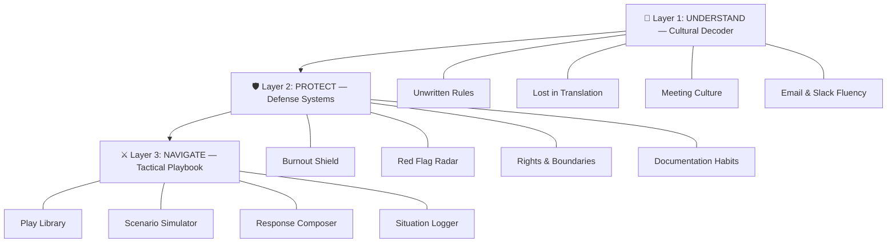

# PlayBook — Office Politics Decoder & Response Trainer

> **"Recognize the play. Choose your move. Protect your work."**

A premium single-page web application that helps non-native speakers navigate American corporate culture — from hidden political plays to unwritten rules to burnout prevention.

## Redesigned Conceptual Architecture

Your original concept is strong but frames everything through an adversarial lens ("plays," "counter-moves"). For non-native speakers, the bigger challenge is **cultural illiteracy** — not knowing the rules of a game they didn't grow up playing. The redesign preserves your tactical modules but wraps them in a broader, more empowering framework.

### 🏗️ Three Strategic Layers (Instead of Flat Modules)



---

## Layer 1: 🧭 UNDERSTAND — The Cultural Decoder

**Purpose**: Bridge the cultural gap *before* politics even enters the picture.

Most non-native speakers don't get burned by Machiavellian colleagues — they get burned by **not understanding the implicit social contract**. This layer teaches the "operating system" of American corporate culture.

### Modules

#### 1.1 Unwritten Rules
The things nobody tells you but everyone judges you on:
- **"Managing up"** — what it means, why it matters, how to do it
- **"Visibility work"** — why doing great work isn't enough; you have to be *seen* doing it
- **"Political capital"** — the invisible currency of favors, alliances, and reputation
- **The promotion game** — performance ≠ promotion; perception + sponsorship = promotion
- **"Culture fit"** — what it actually means and how it can be weaponized

#### 1.2 Lost in Translation
American English phrases that mean something completely different than their literal meaning:
| They Say | They Mean | Why It Matters |
|----------|-----------|----------------|
| "Let's take this offline" | "Stop talking about this now" | You may think it's a scheduling suggestion |
| "That's interesting" | "I disagree but won't say so" | You may think they're genuinely interested |
| "Let's circle back" | "I'm shelving this / I don't want to deal with it now" | You may keep waiting for the follow-up |
| "I'll think about it" | "No" | You may think a decision is pending |
| "Going forward..." | "You messed up, don't do it again" | You may miss that you're being corrected |
| "With all due respect..." | "I'm about to disagree strongly" | You may take it at face value |
| "Per my last email" | "I already told you this — read it" | You may miss the irritation |

*(Full library of ~50 phrases with cultural context, YouTube video links, and practice examples)*

#### 1.3 Meeting Culture
- **Who speaks, when, and how** — the turn-taking system Americans internalize
- **"Having a voice"** — the expectation that silence = disengagement
- **Pre-meeting alignment** — the real decisions happen *before* the meeting
- **"Parking lot"** — how ideas get sidelined (sometimes strategically)

#### 1.4 Email & Slack Fluency
- **Tone calibration** — the narrow band between "too formal" and "too casual"
- **CC politics** — when to CC someone, when *not* to, and what it signals
- **Response timing** — what your reply speed communicates
- **Emoji & reactions** — the invisible language of 👍 vs ✅ vs ❤️

Each module includes **curated YouTube videos**, **real examples**, **cultural context explanations**, and **self-assessment quizzes**.

---

## Layer 2: 🛡️ PROTECT — Defense Systems

**Purpose**: Build structural defenses *before* you need them.

This is the proactive layer — things to set up on Day 1, Week 1, Month 1.

### Modules

#### 2.1 Burnout Shield (Timeline-Based Protection)
A structured guide organized by your tenure:

**🟢 Day 1–7: Foundation Setting**
- Clarify reporting lines and decision authority *in writing*
- Set up a personal work log (template provided)
- Identify 2-3 "safe" colleagues to observe and learn from
- Ask about communication preferences *explicitly*

**🟡 Week 2–4: Boundary Architecture**
- Establish response-time norms (don't set a precedent of midnight emails)
- Learn the "no" vocabulary: "I'd love to, but my bandwidth is committed to X"
- Identify energy drains vs energy sources in your role
- Start documenting wins weekly

**🟠 Month 2–3: Pattern Recognition**
- Compare stated values vs actual behavior in the team
- Notice who gets credit, who gets blame, who gets protected
- Assess: are you being developed or exploited?
- Build a 90-day self-review

**🔴 Month 4+: Strategic Positioning**
- Evaluate sponsorship (does someone advocate for you in rooms you're not in?)
- Check: are you on a growth path or a "reliable workhorse" track?
- Build external networks as insurance

#### 2.2 Red Flag Radar (Interactive Checklist)
Expanded from your original concept into a weighted scoring system:

**Category: Role Clarity** (weight: high)
- [ ] Is my job description documented and agreed upon?
- [ ] Are my success metrics clear?
- [ ] Do I know who makes decisions about my work?

**Category: Credit & Visibility** (weight: high)
- [ ] Is there a norm for attributing work to individuals?
- [ ] Do I present my own work, or does someone else present it?
- [ ] Are contributions tracked in a shared system?

**Category: Communication** (weight: medium)
- [ ] Are important decisions communicated broadly or through back-channels?
- [ ] Is there transparency about who knows what?
- [ ] Are 1-on-1 conversations documented?

**Category: Workload** (weight: high)
- [ ] Is the workload distribution visible and fair?
- [ ] Can I say "no" to requests outside my role without consequences?
- [ ] Are weekend/evening expectations explicitly stated?

Output: Risk Score (Green/Yellow/Orange/Red) + Specific boundary-setting recommendations

#### 2.3 Know Your Rights
- **At-will employment** — what it means and what it *doesn't* mean
- **Hostile work environment** — legal definition vs colloquial use
- **Documentation that protects you** — what to save, how to save it, when to escalate
- **HR is not your friend** — understanding HR's actual role
- **Visa-specific vulnerabilities** — how visa status gets weaponized, and what protections exist

#### 2.4 Documentation Habits
- **The BCC-to-self method** — creating a personal paper trail
- **Meeting notes as protection** — "Per our conversation today, here's what we agreed..."
- **The weekly wins email** — visibility + documentation in one move

---

## Layer 3: ⚔️ NAVIGATE — The Tactical Playbook

**Purpose**: Recognize, analyze, and respond to political dynamics.

This is your original concept, refined and organized by **threat category** and **severity level**.

### Modules

#### 3.1 Play Library (~60 Named Plays)
Organized by category with consistent structure:

**🎭 Status & Sympathy Plays** (exploiting empathy and social pressure)
- The Sympathy Shield
- The Martyr Move  
- The "I'm Just Overwhelmed" Deflect
- The Public Vulnerability Play
- The Strategic Tears

**📝 Credit & Authorship Plays** (stealing or diluting your contributions)
- The Quiet Rebrand
- The "We" Hijack
- The Late-Stage Co-author
- The Idea Echo (repeating your idea louder)
- The Strategic Collaboration (joining to claim credit)

**🔒 Control Plays** (creating dependency and limiting your autonomy)
- Account Gatekeeping
- Information Bottleneck
- The Single Point of Failure
- The Approval Maze
- The Knowledge Hoarder

**🚪 Exit Plays** (leaving destructively)
- The Controlled Collapse
- The Drag-Down Resignation
- The Recruit-Then-Pull
- The Scorched Earth Exit
- The "I Was Pushed Out" Narrative

**👑 Authority Plays** (manipulating hierarchy and power structures)
- The Backchannel
- The Faculty/Executive Whisper
- Going Over Your Head
- The Selective Escalation
- The "I Was Just Trying to Help" Overreach

**🌫️ Ambiguity Plays** (exploiting unclear boundaries)
- The Floating Role
- The Initiative Trap
- The Vague RACI
- The Scope Creep Snare
- The "Organic Growth" of Your Responsibilities

**🗣️ Communication Plays** (manipulating information flow)
- The Selective Forward
- The Strategic CC/BCC
- The "I Assumed You Knew"
- The Verbal-Only Agreement
- The Contradicting DM

**🤝 Alliance Plays** (social manipulation)
- The Lunch Table Exclusion
- The False Mentor
- The Strategic Introduction Block
- The Triangulation (telling A one thing, B another)
- The "Everyone Agrees With Me" Bluff

Each play has the structure from your original concept plus:
- **Severity Level**: 🟢 Low / 🟡 Medium / 🟠 High / 🔴 Critical
- **Common in**: Startup / Corporate / Academic / All
- **Cultural blind spot**: Why non-native speakers are especially vulnerable to this
- **Video resources**: Curated YouTube links explaining the dynamic

#### 3.2 Scenario Simulator
Interactive branching scenarios:
- See a situation description with context
- Choose from 3-4 possible responses
- See the **signal** each response sends, the **likely escalation path**, and the **recommended approach**
- Get analysis of your response patterns over time

10 starter scenarios covering the most common situations:
1. Someone presents your idea as their own in a meeting
2. Your manager gives you verbal praise but written criticism
3. A colleague asks you to do work that's clearly their responsibility
4. You're excluded from a key meeting about your project
5. Someone CCs your manager on a trivial mistake
6. You're asked to train your replacement (but told it's a "new team member")
7. A deadline moves up with no discussion but you're still held to the original scope
8. A colleague "helpfully" redoes your work and presents the "improved" version
9. You receive contradictory instructions from two managers
10. Someone takes credit for your work in a company-wide email

#### 3.3 Response Composer
Input: The situation + how you feel
Output: Three calibrated response drafts:
- **🟢 Neutral**: Professional, no confrontation, preserves relationship
- **🟡 Firm-but-Warm**: Clear boundaries with warmth, asserts your position
- **🔴 Boundary-Setting**: Direct, factual, creates clear documentation

#### 3.4 Situation Logger (Private Case File)
- Quick form: What happened? Who? Channel? My reaction? My feeling?
- Auto-tags to a known play
- Generates neutral analysis + suggested next steps
- Builds a private timeline

---

## 📺 Curated Resource Hub (All Free)

Every module links to free, curated resources — embedded contextually, not just listed on a page.

### 🎓 Free Online Courses
| Course | Provider | Maps To |
|--------|----------|--------|
| **Office Politics: Managing Workplace Power Dynamics** | Alison (CPD-accredited) | Play Library + Scenario Simulator (quiz questions → scenarios) |
| **Navigating Workplace Equality: Discrimination, Privilege & Power Dynamics** | edX / UCT | "Why This Play Works" explanations |
| **HBR Guide to Managing Up and Across** | CodeSignal (free cert, ~6 hrs) | Layer 1: Unwritten Rules — Managing Up module |
| **Using Influence to Manage Across** | CodeSignal (free cert, 1 hr) | Layer 2: Boundary Setting |
| **Class Central catalogs** | 23 office politics + 58 workplace dynamics courses | Resource Hub browsing |

### 🎥 YouTube Content (Curated 50+ Videos)
**For Non-Native Speakers Specifically:**
- Tannia Suarez — executive presence, confidence, avoiding over-explaining
- Speak English With Vanessa — natural American English for office small talk
- English In Moments (Elena) — diplomatic English, polite disagreement
- Explearning (Mary Daphne) — speaking up in meetings, power structures
- JForrest English / Mr. English Channel — business vocabulary & email writing

**Office Politics & Unwritten Rules:**
- Ginny Clarke — former Google leader, "Corporate Playbook on Office Politics"
- A Life After Layoff (Bryan Creely) — former Amazon/FedEx recruiter, pulls back the curtain
- Stanford Webinar: "How to Survive Workplace Jerks" (52 min) — escape/endure/outwit strategies
- Careers With Nellie: "Navigate Office Politics and Power Dynamics" — identifying "deep state" influencers
- Doug Howard: "Turning Toxic Situations to Your Advantage" — maps to play taxonomy
- The Next Move Ep. 100: "Navigate Office Politics Without Losing My Soul" — integrity framing
- SOAR Podcast w/ Karen Sterling: "Play Nice or Play Smart?" — handling idea theft

**Burnout & Self-Protection:**
- Emily Durham — "5 Work Boundaries You Need NOW"
- Mel Robbins — "Let Them" Theory for toxic environments
- Jennifer Brick — detaching at work, hidden rules, avoiding becoming a target
- Christina Holloway — "What To Do When You Get Blamed At Work"

**Communication & Boundary Setting:**
- Communication Coach Alexander Lyon — leadership communication
- Stanford GSB "Think Fast, Talk Smart" — impromptu speaking, non-native speaker episodes
- Executive Impressions (Kara Ronin) — executive presence globally
- Abby Medcalf — responding to passive-aggression, "benign interpretation" technique

**Employee Rights (US):**
- Branigan Robertson — employment lawyer, wrongful termination, retaliation
- Employee Survival Guide (Mark Carey) — labor law, severance, at-will employment
- U.S. Department of Labor — official "Know Your Rights" series

### 🎙️ Podcasts
**"Office Politics" by Nick Ledger** (6-part series) — each episode = a ready-made module:
| Episode | Topic | Maps To |
|---------|-------|--------|
| 1. The Shadow Organization | Informal power, gatekeepers, institutional memory | Control Plays + Red Flag Radar |
| 2. The Art of Alliance Building | Transformational vs transactional relationships | Alliance Plays |
| 3. Mapping the Political Landscape | Official org chart vs actual power structure | Red Flag Radar |
| 4-6 | Toxic dynamics, decision-makers, maintenance | Play Library (various) |

### 📖 Articles & Long-Reads
| Article | Author | How It's Used |
|---------|--------|---------------|
| **"Mastering Office Politics: A Strategic Guide"** | Lucio Buffalmano (The Power Moves) | App's intro philosophy + advanced political intelligence framework |
| **"Office Politics: Do's, Don'ts, and Absolute No-Nos"** | Science of People | "Office Human Map" technique → Red Flag Radar module |
| **"The Art of Deception and Manipulation in Corporate Politics"** | Hariharan Balasubramanian (LinkedIn) | **Direct conversion to play cards** — Flattery, Withholding, False Urgency, Divide & Conquer |

### Resource Integration Strategy
Resources are NOT just listed on a resource page. They are **embedded contextually**:
- Each **Play Library entry** links to 1-2 relevant videos explaining that dynamic
- Each **Cultural Decoder module** embeds a relevant course or podcast episode
- The **Burnout Shield timeline** links to boundary-setting videos at each phase
- The **Red Flag Radar** links to the Science of People "Office Human Map" article
- The **Resource Hub** page provides the complete organized directory for browsing

---

## Technical Architecture

### Tech Stack
| Layer | Technology | Rationale |
|-------|-----------|-----------|
| **Frontend** | HTML + CSS + Vanilla JS | Zero dependencies, fast, portable, premium feel |
| **Design** | Custom CSS with glassmorphism, dark mode, micro-animations | Premium, modern aesthetic |
| **Data** | Embedded JSON modules | Self-contained, no server needed |
| **Storage** | localStorage | Private situation logger, no data leaves the browser |
| **Hosting** | Static files (GitHub Pages ready) | Free, simple, shareable |

### App Structure
```
Office Politics/
├── index.html              # Main SPA shell
├── css/
│   └── styles.css          # Complete design system
├── js/
│   ├── app.js              # Main app controller & routing
│   ├── data/
│   │   ├── plays.js        # Play library data
│   │   ├── phrases.js      # "Lost in Translation" phrases
│   │   ├── scenarios.js    # Scenario simulator data
│   │   ├── checklists.js   # Red Flag Radar checklists
│   │   ├── resources.js    # YouTube/resource links
│   │   └── timeline.js     # Burnout Shield timeline data
│   ├── modules/
│   │   ├── cultural-decoder.js    # Layer 1 renderer
│   │   ├── defense-systems.js     # Layer 2 renderer
│   │   ├── tactical-playbook.js   # Layer 3 renderer
│   │   ├── scenario-simulator.js  # Interactive scenarios
│   │   ├── response-composer.js   # Response drafting
│   │   ├── situation-logger.js    # Private logger
│   │   └── resource-hub.js        # Video/resource browser
│   └── utils/
│       ├── search.js       # Fuzzy search across all content
│       ├── storage.js      # localStorage wrapper
│       └── animations.js   # Micro-animation utilities
└── assets/
    └── icons/              # SVG icons
```

### Design Aesthetic
- **Dark mode primary** with warm accent colors (gold, amber, teal)
- **Glassmorphism** cards with frosted-glass blur effects
- **Smooth page transitions** with CSS animations
- **Responsive** — works on mobile, tablet, desktop
- **Premium typography** using Inter + JetBrains Mono
- **Color-coded severity system** (green → yellow → orange → red)
- **Subtle micro-animations** on hover, scroll, and interaction

---

## User Review Required

> [!IMPORTANT]
> **Scope Decision**: The full 3-layer architecture with all modules is substantial. I recommend building it as a single premium web app (HTML/CSS/JS) with all content embedded. This makes it:
> - Instantly shareable (no server required)
> - Portfolio-ready (deploy to GitHub Pages)
> - Private (all logging stays in the browser's localStorage)

> [!IMPORTANT]  
> **No LLM Integration in MVP**: The Response Composer and Situation Logger analysis will use **template-based generation** (pre-written response templates with variable substitution) rather than a local LLM. This keeps the app zero-dependency and deployable anywhere. LLM integration can be added later.

## Open Questions

> [!IMPORTANT]
> **Content Depth vs Breadth**: Should I prioritize:
> - **Breadth**: All 3 layers with ~15 plays, ~30 phrases, 5 scenarios, full resource integration (covers everything but thinner per module)
> - **Depth**: Layer 3 (Tactical Playbook) with full 40+ plays and 10 scenarios, with Layers 1-2 as lighter companion sections
> 
> I recommend **Breadth** — the Cultural Decoder (Layer 1) is arguably the most valuable for your target audience, and your curated resources give us rich content for every layer.

## Proposed Changes

### Data Layer
All content is authored as JavaScript modules with structured objects.

#### [NEW] [plays.js](file:///c:/Users/GPU/Documents/GoogleAntigravity/Office%20Politics/js/data/plays.js)
~40-60 named political plays with full metadata (name, surface behavior, intent, red flags, counter-moves, scripts, severity, cultural blind spots)

#### [NEW] [phrases.js](file:///c:/Users/GPU/Documents/GoogleAntigravity/Office%20Politics/js/data/phrases.js)
~50 "Lost in Translation" corporate phrases with literal vs actual meaning

#### [NEW] [scenarios.js](file:///c:/Users/GPU/Documents/GoogleAntigravity/Office%20Politics/js/data/scenarios.js)
10 interactive scenarios with branching choices and analysis

#### [NEW] [checklists.js](file:///c:/Users/GPU/Documents/GoogleAntigravity/Office%20Politics/js/data/checklists.js)
Red Flag Radar weighted checklist items

#### [NEW] [resources.js](file:///c:/Users/GPU/Documents/GoogleAntigravity/Office%20Politics/js/data/resources.js)
Curated YouTube videos and free resources organized by topic

#### [NEW] [timeline.js](file:///c:/Users/GPU/Documents/GoogleAntigravity/Office%20Politics/js/data/timeline.js)
Burnout Shield timeline content (Day 1 → Month 4+)

---

### UI Layer
Single-page app with smooth navigation between all modules.

#### [NEW] [index.html](file:///c:/Users/GPU/Documents/GoogleAntigravity/Office%20Politics/index.html)
Main SPA shell with navigation, section containers, and semantic structure

#### [NEW] [styles.css](file:///c:/Users/GPU/Documents/GoogleAntigravity/Office%20Politics/css/styles.css)
Complete design system: dark theme, glassmorphism, typography, animations, responsive grid, color-coded severity system

---

### Logic Layer

#### [NEW] [app.js](file:///c:/Users/GPU/Documents/GoogleAntigravity/Office%20Politics/js/app.js)
Main controller: routing, navigation, search, module initialization

#### [NEW] [cultural-decoder.js](file:///c:/Users/GPU/Documents/GoogleAntigravity/Office%20Politics/js/modules/cultural-decoder.js)
Renders Layer 1: Unwritten Rules, Lost in Translation, Meeting Culture, Email Fluency

#### [NEW] [defense-systems.js](file:///c:/Users/GPU/Documents/GoogleAntigravity/Office%20Politics/js/modules/defense-systems.js)
Renders Layer 2: Burnout Shield timeline, Red Flag Radar, Rights, Documentation

#### [NEW] [tactical-playbook.js](file:///c:/Users/GPU/Documents/GoogleAntigravity/Office%20Politics/js/modules/tactical-playbook.js)
Renders Layer 3: Play Library with search/filter, play detail cards

#### [NEW] [scenario-simulator.js](file:///c:/Users/GPU/Documents/GoogleAntigravity/Office%20Politics/js/modules/scenario-simulator.js)
Interactive branching scenario engine with scoring

#### [NEW] [response-composer.js](file:///c:/Users/GPU/Documents/GoogleAntigravity/Office%20Politics/js/modules/response-composer.js)
Template-based response generator (3 tone levels)

#### [NEW] [situation-logger.js](file:///c:/Users/GPU/Documents/GoogleAntigravity/Office%20Politics/js/modules/situation-logger.js)
Private case file with localStorage persistence

#### [NEW] [resource-hub.js](file:///c:/Users/GPU/Documents/GoogleAntigravity/Office%20Politics/js/modules/resource-hub.js)
Curated resource browser with YouTube embeds

---

## Verification Plan

### Manual Verification
- Open `index.html` in browser and verify all navigation works
- Test all interactive features (search, filter, simulator, logger)
- Verify localStorage persistence for the situation logger
- Test responsive design at mobile/tablet/desktop breakpoints
- Verify all YouTube links are functional
